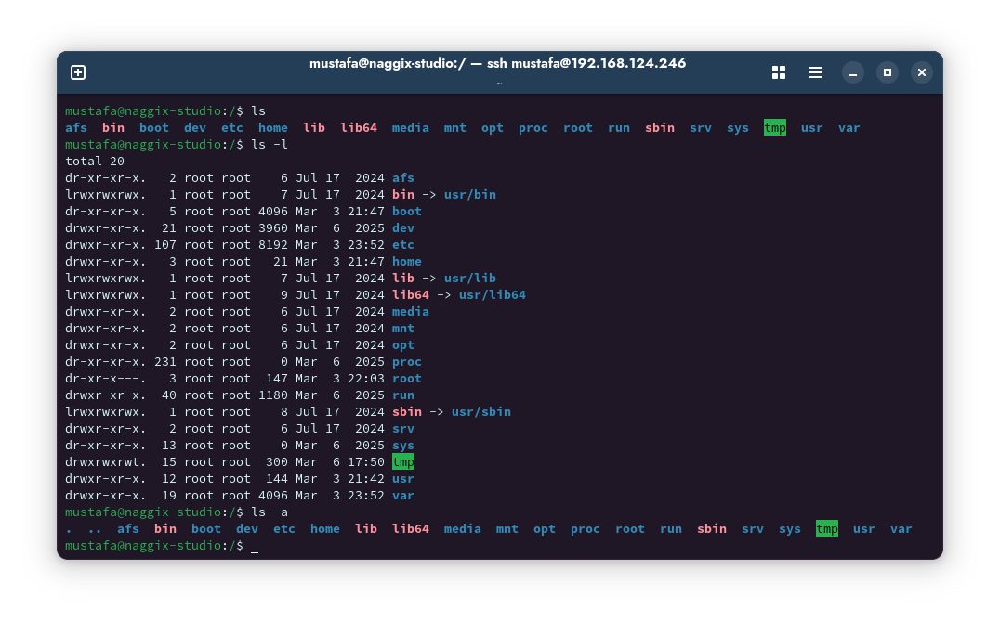
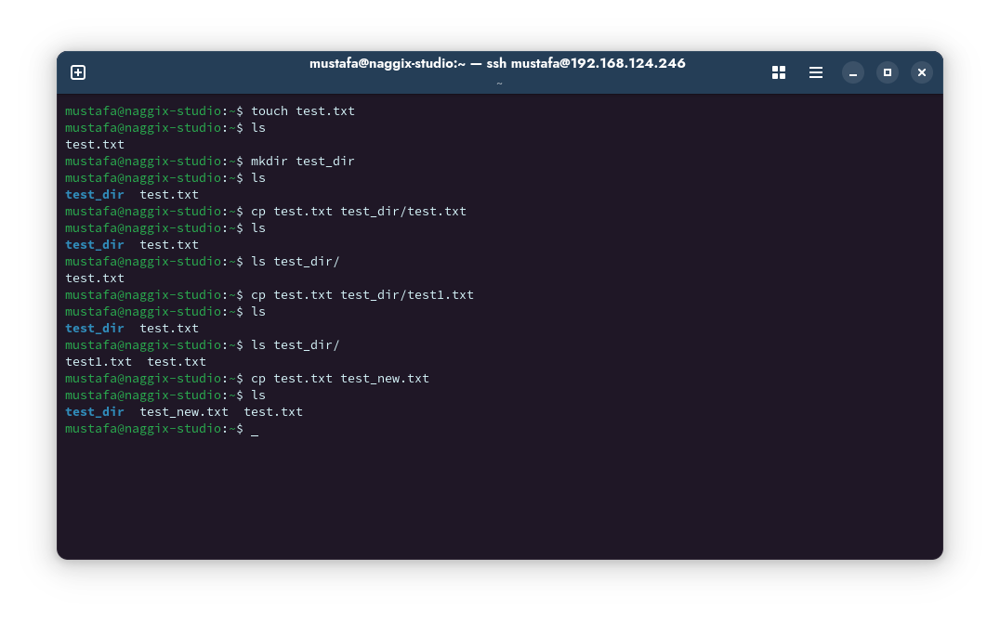

- # سطر أوامر لينكس (Linux Command Line)

- ### إدارة الملفات والمجلدات (File & Directory Management)
```bash
naggix@naggix-studio:~$ ls          # عرض محتويات المجلد الحالي للعمل
naggix@naggix-studio:~$ ls -l       # عرض محتويات المجلد الحالي بشكل قائمة مفصلة
naggix@naggix-studio:~$ ls -a       # عرض جميع محتويات الملفات حتى المخفية منها
```


```bash
naggix@naggix-studio:~$ cd          # تغيير المجلد الحالي إلى مجلد المستخدم
naggix@naggix-studio:~$ cd /        # تغيير المجلد الحالي إلى مجلد Root
naggix@naggix-studio:~$ cd /etc     # تغيير المجلد الحالي إلى المجلد المضمن بعد الأمر
```


```bash
naggix@naggix-studio:~$ pwd          # طباعة مجلد العمل الحالي
```


```bash
naggix@naggix-studio:~$ mkdir dir_name              # إنشاء مجلد جديد في مجلد العمل الحالي
naggix@naggix-studio:~$ mkdir dir_name -m=mode      # تحديد صلاحيات المجلد أثناء إنشائه
```


```bash
naggix@naggix-studio:~$ touch file_name          # إنشاء ملف جديد في مجلد العمل الحالي
```


```bash
naggix@naggix-studio:~$ rm file_name         # حذف ملف من مجلد العمل الحالي
naggix@naggix-studio:~$ rm -r dir_name       # حذف مجلد بما يحتويه تباعا للمجلدات التي داخله
naggix@naggix-studio:~$ rm -f file_name      # حذف ملف بالقوة دون إظهار أي تنبيهات
naggix@naggix-studio:~$ rm -i file_name      # إظهار تنبيه عند كل عملية حذف
```


```bash
naggix@naggix-studio:~$ cp old_dir/file new_dir/file    # نسخ مجلد من مكان لآخر
naggix@naggix-studio:~$ cp old_name new_name            # إعادة تسمية الملف
```
